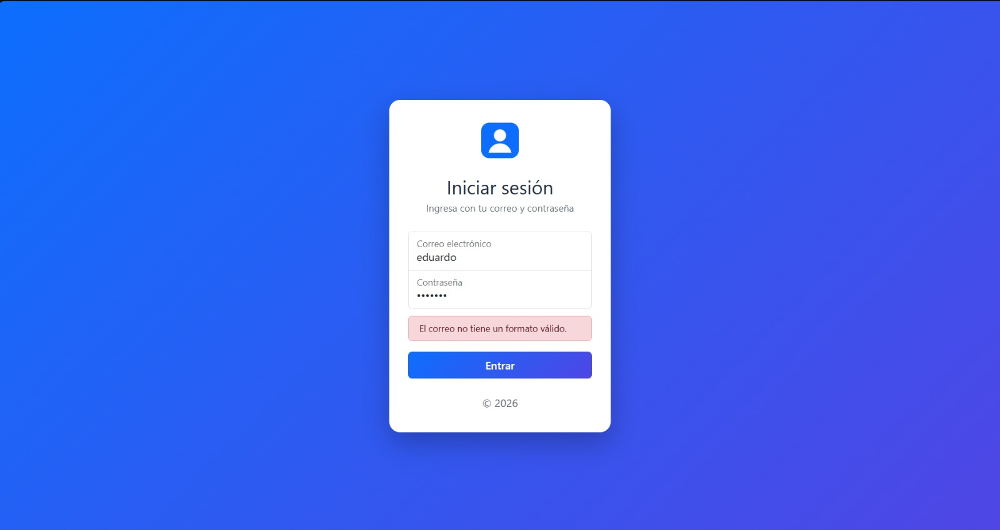
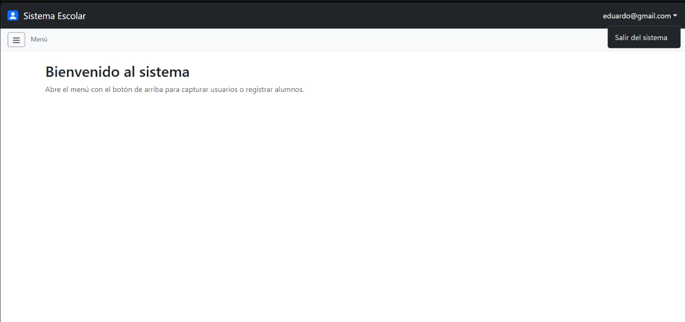
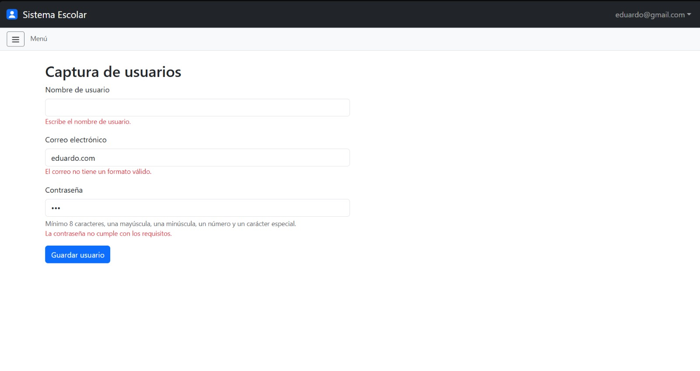
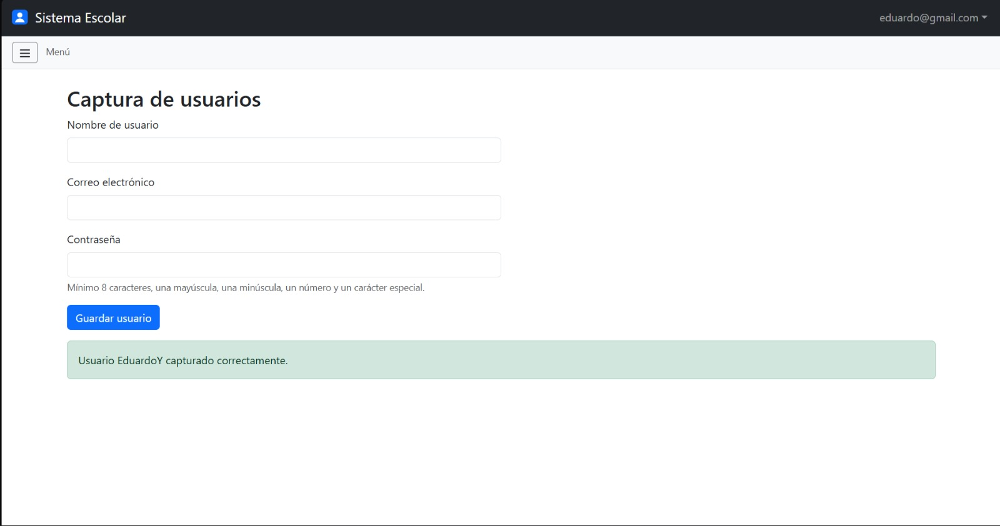
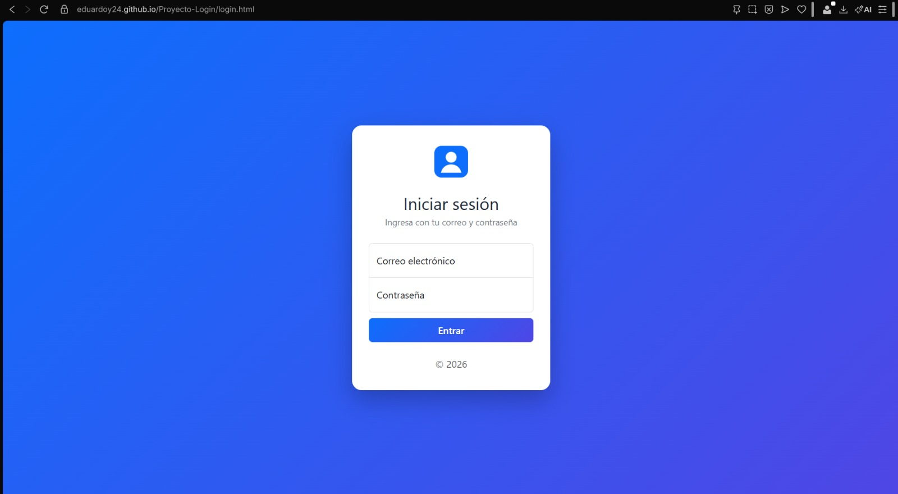

# Proyecto Login

<p align="center">
  
</p>

<p align="center"><b>Login funcional con HTML, CSS y JavaScript que simula el acceso a un sistema escolar.</b></p>

**Integrantes del equipo:**
- Mendoza Martinez Eduardo Yael
- Ruiz Chavez Youri Jorkaeff

**Links:**
- Repositorio: https://github.com/EduardoY24/Proyecto-Login
- Página en vivo (GitHub Pages): https://eduardoy24.github.io/Proyecto-Login/

## Descripción

El proyecto son dos pantallas conectadas. En `login.html` el usuario escribe su correo y contraseña; si los datos son válidos, entra a `index.html`, que es el sistema "por dentro". Ahí hay un navbar con el correo del usuario y la opción de salir, un sidebar con botón hamburguesa, el submenú Usuarios → Captura, el formulario de alumnos con número de control y un modal que indica si el alumno es mayor de edad. No hay backend: todo se simula con JavaScript en el navegador.

**Para probarlo:** abre el link de GitHub Pages e inicia sesión con cualquier correo válido y una contraseña que cumpla los requisitos, por ejemplo `alumno@correo.com` y `Hola123!`.

## Framework CSS

Usamos **Bootstrap 5.3** cargado desde CDN (jsDelivr), sin mezclarlo con otro framework y sin React ni Vue. Lo elegimos porque además de los estilos trae el JavaScript de los componentes que necesitábamos: el **dropdown** del usuario en el navbar, el **offcanvas** del sidebar, el **collapse** del submenú y el **modal** de edad. El login parte del ejemplo oficial *Sign-in* de Bootstrap, al que le dimos un diseño propio.

## Estructura del proyecto

```
Proyecto-Login/
├── README.md
├── login.html        → pantalla de acceso
├── index.html        → sistema (navbar, sidebar, formularios y modal)
├── css/
│   └── login.css     → estilos del login y del sidebar
├── js/
│   ├── utileria.js   → librería de funciones (actividad anterior)
│   ├── login.js      → validación del login y redirección
│   ├── index.js      → navbar con el usuario, salir, protección y captura
│   └── sistema.js    → sidebar, secciones, alumnos y modal
└── img/              → logo, iconos y capturas
```

## ¿Cómo fluye el login hacia el sistema?

1. En `login.html` el usuario escribe su correo y contraseña y da clic en **Entrar**.
2. `login.js` detiene el envío normal del formulario con `event.preventDefault()` y valida los datos con `validarCorreo` y `validarPassword` de `utileria.js`.
3. Si algo está mal, se muestra el error en un aviso rojo y no se avanza.
4. Si todo está bien, se guarda el correo en `sessionStorage` y se redirige a `index.html` con `window.location.href`.
5. Al cargar `index.html`, `index.js` revisa si hay una sesión guardada. Si no la hay, regresa a `login.html` (así nadie entra escribiendo la URL directo).
6. En el navbar, la opción **Salir del sistema** borra la sesión y regresa al login.

```
login.html ──(datos válidos)──► index.html ──(Salir)──► login.html
                                    │
                         (sin sesión) └──► login.html
```

## ¿Cómo se pasa el nombre de usuario del login al navbar?

Como son dos archivos HTML distintos, las variables de JavaScript se pierden al cambiar de página. Por eso usamos `sessionStorage`, un almacenamiento del navegador que conserva datos mientras la pestaña está abierta. Acordamos la llave `"usuario"` para guardarlo:

```javascript
// login.js: al pasar la validación, guardamos el correo
sessionStorage.setItem("usuario", valorCorreo);
window.location.href = "index.html";
```

```javascript
// index.js: al cargar el sistema, lo leemos y lo ponemos en el navbar
var usuario = sessionStorage.getItem("usuario");
nombreUsuario.textContent = usuario;
```

El navbar muestra el correo con el que se inició sesión (la actividad permite mostrar el nombre o el correo). Elegimos `sessionStorage` en lugar de `localStorage` porque se borra al cerrar la pestaña, lo que se parece más a una sesión real.

## Parte del Integrante: Mendoza Martinez Eduardo Yael: acceso y sesión

**Integrante:** Mendoza Martinez Eduardo Yael

Mi parte fue todo lo relacionado con el acceso: la pantalla de login con su diseño y validación, el navbar con el correo del usuario, la opción de salir, la protección de `index.html` y el formulario de Captura de usuarios. Mi código está en `js/login.js` y `js/index.js`, y mis estilos están en `css/login.css`, en el bloque marcado como "Integrante A".

### Proceso de creación

**1. Estructura del proyecto y base del login.**
Creé el repositorio con las carpetas `css`, `js` e `img`, y copié `utileria.js` de nuestra actividad anterior. Como la actividad pide la función `validarPassword` y en nuestra librería se llamaba `validarContra`, agregué `validarPassword` al final de `utileria.js`, que llama a `validarContra`. Para `login.html` descargué el ejemplo *Sign-in* de Bootstrap 5.3, lo traduje al español, cambié las rutas locales de Bootstrap por el CDN, quité el código que solo servía para la documentación de Bootstrap (el selector de tema claro/oscuro y sus estilos) y les puse `id` a los campos (`formLogin`, `correo`, `password`, `errorLogin`) para usarlos desde JavaScript. También dejé un esqueleto de `index.html` con comentarios que marcan la zona de cada integrante, para no editar lo mismo al mismo tiempo.

**2. Validación del login.**
En `login.js` escucho el evento `submit` del formulario. Primero uso `event.preventDefault()` para que la página no se recargue, luego valido el correo con `validarCorreo` y la contraseña con `validarPassword`. Si alguna falla, muestro el mensaje en el aviso rojo (quitándole la clase `d-none`) y uso `return` para detener todo. Si las dos pasan, guardo el correo en `sessionStorage` y redirijo a `index.html`.



**3. Navbar con el correo del usuario.**
En `index.html` agregué un navbar oscuro de Bootstrap con el logo y el nombre del sistema a la izquierda. A la derecha puse un **dropdown** (`data-bs-toggle="dropdown"`) cuyo texto es el correo del usuario y que despliega la opción "Salir del sistema". En `index.js` leo el correo con `sessionStorage.getItem("usuario")` y lo escribo en el elemento `nombreUsuario`.



**4. Salir del sistema y protección de index.**
Al dar clic en "Salir del sistema" borro el usuario con `sessionStorage.removeItem("usuario")` y regreso a `login.html`. Además, al inicio de `index.js` reviso si hay sesión: si `getItem` regresa `null`, mando al usuario al login. En los dos casos uso `window.location.replace()` en lugar de `href`, para que el botón "Atrás" del navegador no regrese al sistema después de salir.

**5. Formulario de Captura de usuarios.**
Dentro de `<main>` creé la sección `seccionCaptura`, que es la que muestra el submenú Usuarios → Captura del sidebar de Youri (acordamos ese `id` desde el principio). Tiene los campos nombre de usuario, correo y contraseña, un texto de ayuda con los requisitos de la contraseña y un mensaje de éxito oculto. Le puse `novalidate` para que la validación la haga nuestro JavaScript y no el navegador.

**6. Validación de la Captura.**
En `index.js` valido el formulario al enviarse: que el nombre de usuario no esté vacío, el correo con `validarCorreo` y la contraseña con `validarPassword`. A diferencia del login, aquí no detengo la validación en el primer error, sino que reviso todos los campos y marco cada error debajo de su campo, igual que en el formulario de alumnos. Si todo es correcto, muestro el mensaje verde con el nombre capturado y limpio el formulario con `reset()`.





**7. Diseño propio del login.**
Le di estilo propio al ejemplo de Bootstrap en `login.css`: fondo con degradado azul-morado, tarjeta blanca con esquinas redondeadas y sombra, un subtítulo, borde morado en los campos al escribir y el botón "Entrar" con el mismo degradado y un pequeño efecto al pasar el mouse. Todos estos estilos usan las clases `pagina-login` y `tarjeta-login`, para que no afecten a `index.html`, que también usa `login.css`.



### Métodos principales

**Los que escribí en `js/login.js` y `js/index.js`:**

| Método / evento | Qué hace |
|---|---|
| `mostrarError(mensaje)` | Muestra el mensaje en el aviso rojo del login. |
| `submit` de `formLogin` | Valida el login, guarda el correo en la sesión y redirige a `index.html`. |
| `click` de `btnSalir` | Borra la sesión y regresa a `login.html`. |
| `submit` de `formCaptura` | Valida nombre, correo y contraseña de la captura y muestra errores o el mensaje de éxito. |
| `validarPassword(contrasena)` | La agregué a `utileria.js`; usa `validarContra` con el nombre que pide la actividad. |

**Los que reutilicé de `utileria.js`:**

| Función | Para qué la usé |
|---|---|
| `validarCorreo(correo)` | Revisar el formato del correo en el login y en la captura. |
| `validarPassword(contrasena)` | Revisar que la contraseña tenga mínimo 8 caracteres, mayúscula, minúscula, número y carácter especial. |

**Del navegador y de Bootstrap:**

| Método | Para qué lo usé |
|---|---|
| `sessionStorage.setItem / getItem / removeItem` | Guardar, leer y borrar el usuario de la sesión. |
| `window.location.href` | Ir del login al sistema. |
| `window.location.replace()` | Salir del sistema y proteger `index.html` sin dejarlo en el historial. |
| Dropdown de Bootstrap (`data-bs-toggle="dropdown"`) | Desplegar el menú del usuario en el navbar. |

## Parte del Integrante: Ruiz Chavez Youri Jorkaeff: sistema interno

**Integrante:** Ruiz Chavez Youri Jorkaeff

Mi parte del proyecto fue todo lo que se ve **dentro** del sistema, en `index.html`: el menú lateral (sidebar) con su botón hamburguesa, el submenú Usuarios → Captura, el formulario de alumnos con número de control y el modal que indica si el alumno es mayor de edad. Mi código está en `js/sistema.js`, y mis estilos están al final de `css/login.css`, dentro de un bloque marcado como "Integrante B". Los iconos del menú están en la carpeta `img`.

### Proceso de creación

**1. Esqueleto del sidebar.**
Para el menú lateral usé el componente **Offcanvas** de Bootstrap, que es un panel que se desliza desde la izquierda. Lo elegí porque no obliga a cambiar la estructura de la página (el `<main>` de mi compañero quedó intacto), funciona bien en pantallas pequeñas y Bootstrap ya se encarga de la animación. El panel tiene un encabezado con un botón para cerrarlo y una lista de opciones (Inicio y Alumnos) con sus iconos. Agregué los estilos de las opciones al final de `login.css` y enlacé mi archivo `js/sistema.js` en `index.html`.


**2. Botón hamburguesa.**
Puse una barra pequeña debajo del navbar con un botón de tres rayitas. Lo programé en `sistema.js`: al hacer clic, le pido a Bootstrap el control del panel con `bootstrap.Offcanvas.getOrCreateInstance()` y uso su método `toggle()`, que abre el panel si está cerrado y lo cierra si está abierto. El panel también se cierra con su botón X, con la tecla Esc o al hacer clic fuera de él.

**3. Submenú Usuarios → Captura.**
Agregué la opción "Usuarios", que no lleva a ninguna página: al hacer clic despliega la opción "Captura". Este desplegable lo resuelve el componente **collapse** de Bootstrap con el atributo `data-bs-toggle="collapse"`, sin que yo tenga que programar la lógica de abrir y cerrar. La opción "Captura" muestra la sección `seccionCaptura`, que construyó mi compañero Eduardo, así que acordamos los `id` de las secciones desde el principio para que mi menú y su formulario se conectaran sin problemas.


**4. Sección de alumnos.**
Creé dos secciones dentro de `<main>`: una de bienvenida (`seccionInicio`) y la de alumnos (`seccionAlumnos`), que contiene el formulario con nombre, número de control y fecha de nacimiento. La función `mostrarSeccion` se encarga de mostrar solo la sección elegida en el menú y ocultar las demás.

**5. Validación del número de control.**
El número de control debe tener exactamente 6 dígitos. La función `validarLongitud` de `utileria.js` solo revisa que un número **no pase** de la longitud máxima, así que no era suficiente por sí sola (por ejemplo, `12` pasaría la validación aunque no tenga 6 dígitos). Por eso combiné varias revisiones, y cada una muestra su propio mensaje de error:

- Que el campo no esté vacío.
- Que todos los caracteres sean dígitos del 0 al 9 (con la función `soloDigitos`, que hice yo).
- Que no tenga más de 6 dígitos (con `validarLongitud(numeroControl, 6)`).
- Que tenga al menos 6 dígitos (comparando `numeroControl.length`).

No puse el atributo `maxlength` en el campo a propósito, porque con él el navegador no deja escribir más de 6 dígitos y no se podría comprobar el error de "más de 6".


**6 y 7. Modal de edad.**
Para la ventana emergente usé el componente **Modal** de Bootstrap. Primero armé su estructura en HTML (título, cuerpo vacío y botones para cerrar) y después programé la lógica: cuando el nombre y el número de control son válidos, reviso la fecha de nacimiento (que no esté vacía ni sea del futuro), calculo la edad con `calcularEdad` y pregunto con `esMayorDeEdad` si tiene 18 años o más. Con ese resultado escribo un mensaje en el cuerpo del modal y lo muestro con `bootstrap.Modal.getOrCreateInstance(...).show()`.


### Métodos principales

**Los que escribí en `js/sistema.js`:**

| Método | Qué hace |
|---|---|
| `mostrarSeccion(idSeccionAMostrar)` | Muestra la sección indicada, oculta las demás y cierra el sidebar. |
| `conectarEnlace(idEnlace, idSeccion)` | Conecta una opción del menú con la sección que debe mostrar. |
| `soloDigitos(texto)` | Devuelve `true` si el texto tiene únicamente dígitos del 0 al 9. |

```javascript
// Conecto cada opción del menú con su sección
conectarEnlace("enlaceInicio", "seccionInicio");
conectarEnlace("enlaceCaptura", "seccionCaptura");
conectarEnlace("enlaceAlumnos", "seccionAlumnos");
```

**Los que reutilicé de `utileria.js`:**

| Función | Para qué la usé |
|---|---|
| `validarLongitud(numero, maxLongitud)` | Revisar que el número de control no pase de 6 dígitos. |
| `calcularEdad(fechaNacimiento)` | Obtener la edad del alumno a partir de su fecha de nacimiento. |
| `esMayorDeEdad(fechaNacimiento)` | Saber si el alumno tiene 18 años o más. |

**Los de la API de Bootstrap que utilicé:**

| Método | Para qué lo usé |
|---|---|
| `bootstrap.Offcanvas.getOrCreateInstance(elemento)` | Obtener el control del sidebar. Con `.toggle()` lo abro o lo cierro, y con `.hide()` lo cierro. |
| `bootstrap.Modal.getOrCreateInstance(elemento)` | Obtener el control del modal. Con `.show()` lo muestro. |

## Capturas del flujo completo

Todas las capturas se tomaron desde GitHub Pages.

**1. Login:** el usuario escribe su correo y contraseña.


**2. Validación:** si los datos no son válidos, no se puede entrar.


**3. Dentro del sistema:** el navbar muestra el correo del usuario y el menú para salir.


**4. Sidebar:** se abre con el botón hamburguesa.


**5. Usuarios → Captura:** formulario validado.


**6. Alumnos:** número de control de 6 dígitos.


**7. Modal de edad:**


**8. Salir:** desde el menú del navbar, "Salir del sistema" borra la sesión y regresa a `login.html`.

## Participación

Dividimos el trabajo por partes y cada quien subió sus propios avances desde su cuenta:

| Integrante | Parte |
|---|---|
| Mendoza Martinez Eduardo Yael | Login, diseño del login, navbar con usuario, salir del sistema, protección de index, formulario de Captura, GitHub Pages |
| Ruiz Chavez Youri Jorkaeff | Sidebar con hamburguesa, submenú Usuarios → Captura, navegación entre secciones, formulario de alumnos, número de control, modal de edad |
