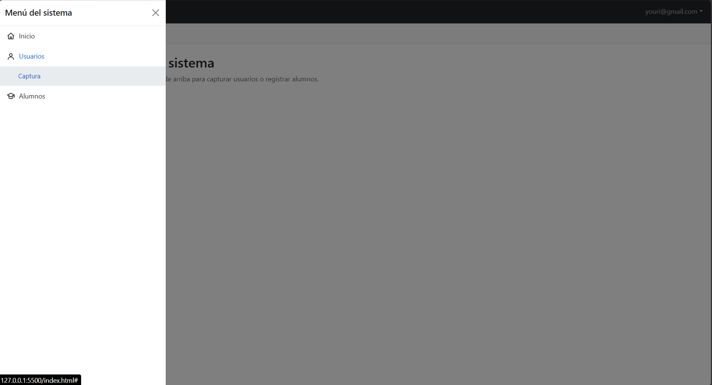
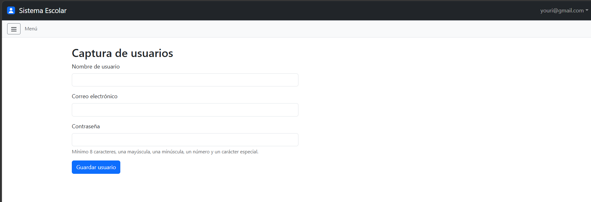
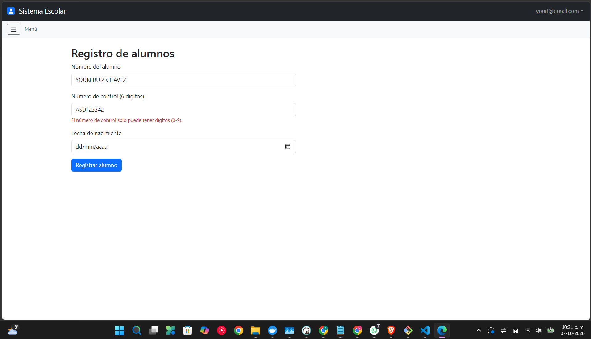
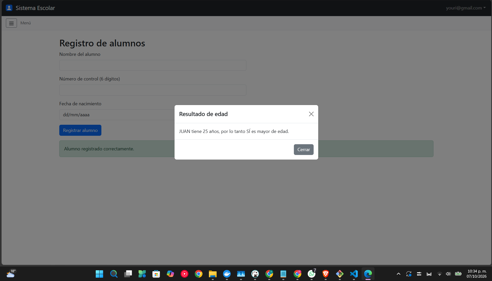
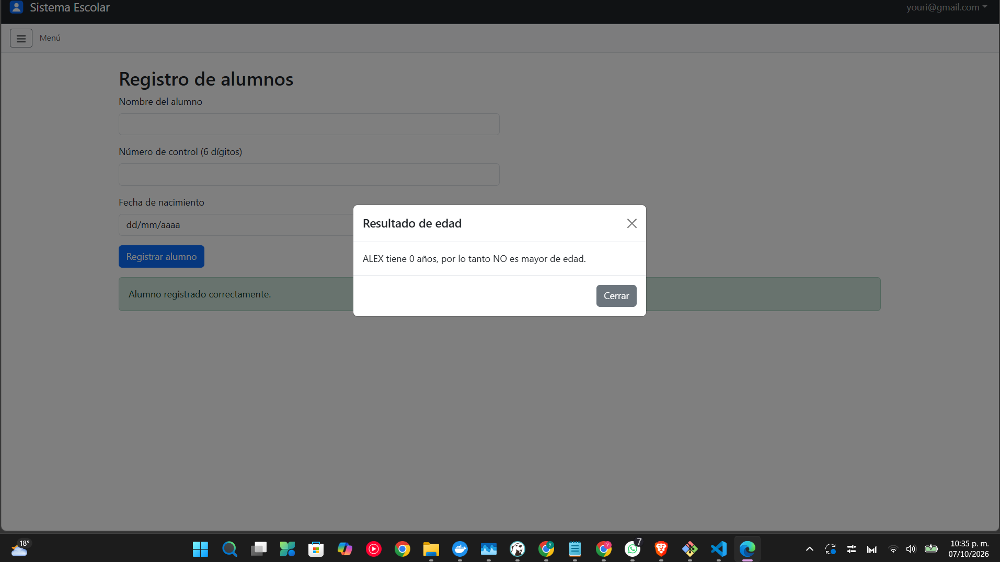

# Proyecto Login

**Integrantes:**
- Mendoza Martinez Eduardo Yael
- Ruiz Chavez Youri Jorkaeff

Login funcional en HTML, CSS y JS con Bootstrap 5 que simula el acceso a un sistema.

> Documentación en construcción.
## Parte del Integrante: Ruiz Chavez Youri Jorkaeff: sistema interno

**Integrante:** Ruiz Chavez Youri Jorkaeff

Mi parte del proyecto fue todo lo que se ve **dentro** del sistema, en `index.html`: el menú lateral (sidebar) con su botón hamburguesa, el submenú Usuarios → Captura, el formulario de alumnos con número de control y el modal que indica si el alumno es mayor de edad. Mi código está en `js/sistema.js`, y mis estilos están al final de `css/login.css`, dentro de un bloque marcado como "Integrante B". Los iconos del menú están en la carpeta `img`.

### Proceso de creación

**1. Esqueleto del sidebar.**
Para el menú lateral usé el componente **Offcanvas** de Bootstrap, que es un panel que se desliza desde la izquierda. Lo elegí porque no obliga a cambiar la estructura de la página (el `<main>` de mi compañero quedó intacto), funciona bien en pantallas pequeñas y Bootstrap ya se encarga de la animación. El panel tiene un encabezado con un botón para cerrarlo y una lista de opciones (Inicio y Alumnos) con sus iconos. Agregué los estilos de las opciones al final de `login.css` y enlacé mi archivo `js/sistema.js` en `index.html`.



**2. Botón hamburguesa.**
Puse una barra pequeña debajo del navbar con un botón de tres rayitas. Lo programé en `sistema.js`: al hacer clic, le pido a Bootstrap el control del panel con `bootstrap.Offcanvas.getOrCreateInstance()` y uso su método `toggle()`, que abre el panel si está cerrado y lo cierra si está abierto. El panel también se cierra con su botón X, con la tecla Esc o al hacer clic fuera de él.

**3. Submenú Usuarios → Captura.**
Agregué la opción "Usuarios", que no lleva a ninguna página: al hacer clic despliega la opción "Captura". Este desplegable lo resuelve el componente **collapse** de Bootstrap con el atributo `data-bs-toggle="collapse"`, sin que yo tenga que programar la lógica de abrir y cerrar. La opción "Captura" muestra la sección `seccionCaptura`, que construyó mi compañero Eduardo, así que acordamos los `id` de las secciones desde el principio para que mi menú y su formulario se conectaran sin problemas.


**4. Sección de alumnos.**
Creé dos secciones dentro de `<main>`: una de bienvenida (`seccionInicio`) y la de alumnos (`seccionAlumnos`), que contiene el formulario con nombre, número de control y fecha de nacimiento. La función `mostrarSeccion` se encarga de mostrar solo la sección elegida en el menú y ocultar las demás.

**5. Validación del número de control.**
El número de control debe tener exactamente 6 dígitos. La función `validarLongitud` de `utileria.js` solo revisa que un número **no pase** de la longitud máxima, así que no era suficiente por sí sola (por ejemplo, `12` pasaría la validación aunque no tenga 6 dígitos). Por eso combiné varias revisiones, y cada una muestra su propio mensaje de error:

- Que el campo no esté vacío.
- Que todos los caracteres sean dígitos del 0 al 9 (con la función `soloDigitos`, que hice yo).
- Que no tenga más de 6 dígitos (con `validarLongitud(numeroControl, 6)`).
- Que tenga al menos 6 dígitos (comparando `numeroControl.length`).

No puse el atributo `maxlength` en el campo a propósito, porque con él el navegador no deja escribir más de 6 dígitos y no se podría comprobar el error de "más de 6".




**6 y 7. Modal de edad.**
Para la ventana emergente usé el componente **Modal** de Bootstrap. Primero armé su estructura en HTML (título, cuerpo vacío y botones para cerrar) y después programé la lógica: cuando el nombre y el número de control son válidos, reviso la fecha de nacimiento (que no esté vacía ni sea del futuro), calculo la edad con `calcularEdad` y pregunto con `esMayorDeEdad` si tiene 18 años o más. Con ese resultado escribo un mensaje en el cuerpo del modal y lo muestro con `bootstrap.Modal.getOrCreateInstance(...).show()`.





### Métodos principales

**Los que escribí en `js/sistema.js`:**

| Método | Qué hace |
|---|---|
| `mostrarSeccion(idSeccionAMostrar)` | Muestra la sección indicada, oculta las demás y cierra el sidebar. |
| `conectarEnlace(idEnlace, idSeccion)` | Conecta una opción del menú con la sección que debe mostrar. |
| `soloDigitos(texto)` | Devuelve `true` si el texto tiene únicamente dígitos del 0 al 9. |

```javascript
// Conecto cada opción del menú con su sección
conectarEnlace("enlaceInicio", "seccionInicio");
conectarEnlace("enlaceCaptura", "seccionCaptura");
conectarEnlace("enlaceAlumnos", "seccionAlumnos");
```

**Los que reutilicé de `utileria.js`:**

| Función | Para qué la usé |
|---|---|
| `validarLongitud(numero, maxLongitud)` | Revisar que el número de control no pase de 6 dígitos. |
| `calcularEdad(fechaNacimiento)` | Obtener la edad del alumno a partir de su fecha de nacimiento. |
| `esMayorDeEdad(fechaNacimiento)` | Saber si el alumno tiene 18 años o más. |

**Los de la API de Bootstrap que utilicé:**

| Método | Para qué lo usé |
|---|---|
| `bootstrap.Offcanvas.getOrCreateInstance(elemento)` | Obtener el control del sidebar. Con `.toggle()` lo abro o lo cierro, y con `.hide()` lo cierro. |
| `bootstrap.Modal.getOrCreateInstance(elemento)` | Obtener el control del modal. Con `.show()` lo muestro. |

